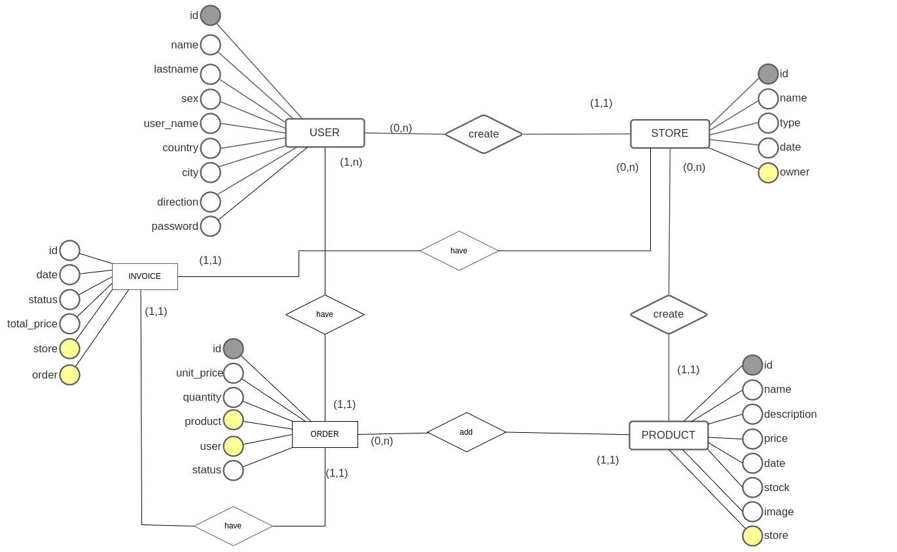
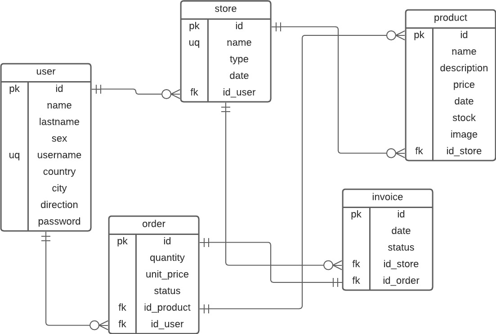

# Tienda

## Descripción
* La aplicacion de tienda permitira que un usuario se **registre**, para ello se solicitara su (*nombre, apellido, sexo, nombre de usuario, pais, ciudad, direccion, contraseña*).
* Una vez se registre, se le creara un perfil donde podra visualizar las siguientes opciones **ver productos**,**crear tienda**, en caso de tener una tienda ya creada se mostrara la opcion de **ver mis tiendas**, **agregar foto de perfil**, **carrito de compras**, **cerrar sesión**
  * La opcion **ver productos**, llevara al usuario a una pantalla donde se visualizaran todos los productos que se estan vendiendo; se visualizara: *1 ó + imagenes del producto, nombre del producto, nombre de la tienda, y el precio en dolares, y un boton de más detalles*.
  * La opcion **crear tienda**, permite que el usuario pueda vender sus productos, para ello el usuario debe llenar un formulario ingresando los siguientes datos *nombre de la tienda, tipo de articulos y un boton de crear y otro de cancelar*
  * **ver mis tiendas**, aqui el usuario podra ver una lista sus teindas creadas, se visalizara el *(nombre de la teinda, fecha de creacion)* y un boton de ir a tienda.
  * **carrito de compras**, aui el usuario podra ver los productos que ha agregado al carrito de compras y podra efectuar el pago; podra visualizar *(nombre producto, precio, cantidad)* y al final de todo un boton de pagar.
* cuando el **usuario cree su tienda** aparecera un menu de opciones: *agregar nuevo producto, ver lista de prodcutos, ventas pendientes de envio, productos vendidos*.
  * **agregar nuevo Producto**, si el usuario selecciona esta opcion, se desplegara un formulario con los siguientes campos *nombre del producto, descripcion, precio en dolares*, **es obligatorio que el usuario suba almenos una foto del producto**, tambien apareceran 2 botones uno de crear y otro de cancelar.
  * **ver lista de prodcutos** esta sera la opcion por defecto, mostrara un panel con todos los prodcutos creados con dos opcion es **editar o eliminar**
  * **ventas pendientes de envio** en esta opcion el usuario podra ver los pedidos de otros usuarios que ya haigan realizado el pago,  se visualizara los siguientes datos *(nombre del usuario, direccion, pais, nombre del producto, cantidad, imagen del producto)* 
  * **productos vendidos** en aqui se mostrara una lista de los productos que ya fueron enviados y el total del monto de dinero recaudado por las ventas.

## Diseño en Figma

## Tareas
### Data Base
* [x] diseño conceptual
  
* [x] diseño logico
  
* [x] diseño fisico
* [x] definir consultas
  
  ---USUARIO---
  * [x] crear usaurio
  * [x] obtener los datos del usuario solo con su user_name
  * [ ] mostrar los datos del usuario especifico
  * [x] editar los datos de usuario (nombre, apellido, sexo, username, contraseña, pais, cuidad, direccion, foto)
  
  ---CLIENTE---
  * [x] obtener todos los productos de las tiendas(nombre, imagen, precio, tienda)
  * [x] obtener informacion de un solo producto (foto, nombre, descripcion, tienda, precio, stock)
  * [x] agregar producto al carrito de compras 
  * [x] mostrar productos agregados al carrito de compra de un usuario especifico(foto, producto, cantidad)
  * [x] comprar producto(fecha, status, tienda), generar factura
  
  ---VENDEDOR---
  * [x] crear tienda
  * [x] crear producto (nombre, precio, descripcion, imagen)
  * [x] mostrar los productos creados(nombre, precio, foto)
  * [x] editar productos (nombre, precio, descripcion, imagen)
  * [x] mostrar las tiendas que pertenecen a un usuario especifico(nombre, fecha)
  * [x] mostrar las compras pendientes de envio de una teinda en especifico(foto, cliente, pais, ciudad, direccion, fecha, producto, cantidad)
  * [x] enviar producto al cliente
  * [x] mostrar todos los productos vendidos, es decir, que ya haigan sido enviados(nombre fecha monto total).
  * [x] obtener la suma de todos los precios del ultimo mes
### Backend
* [x] levantar el servidor
* [x] conectar con la base de datos
* [x] crear rutas POST para almacenar datos
* [x] crear rutas GET
* [x] crear rutas UPDATE
* [ ] crear Rutas DELETE
* [x] crear ruta de registro de usuario
* [x] encriptar contraseña
* [x] crear autenticacion de usuario
### Frontend
* [x] crear header
* [x] crear menu
* [x] crear tienda
* [ ] visualizar todas dal tiendas del usuario
* [ ] crear producto nuevo
* [ ] visualizar todos los productos creados
* [ ] editar producto
* [ ] borrar producto 
* [ ] ver todos los productos que se venden
* [ ] ver detalles del producto
* [ ] agregar al carrito de compra
* [ ] ver carrito de compra
* [ ] comprar producto
* [ ] enviar producto
* [ ] visualizar ventas
* [x] registrar usuario nuevo
* [x] autenticar usuario
* [x] cerrar sesion
* [x] proteger rutas
* [x] editar datos del usaurio   

## Recursos de Internet

Foto de <a href="https://unsplash.com/@midashofstra?utm_source=unsplash&utm_medium=referral&utm_content=creditCopyText">Midas Hofstra</a> en <a href="https://unsplash.com/es/fotos/a6PMA5JEmWE?utm_source=unsplash&utm_medium=referral&utm_content=creditCopyText">Unsplash</a>
Foto de <a href="https://unsplash.com/@gabrielsalas?utm_source=unsplash&utm_medium=referral&utm_content=creditCopyText">Gabriel Salas</a> en <a href="https://unsplash.com/es/fotos/YnENabLdEKY?utm_source=unsplash&utm_medium=referral&utm_content=creditCopyText">Unsplash</a>
  