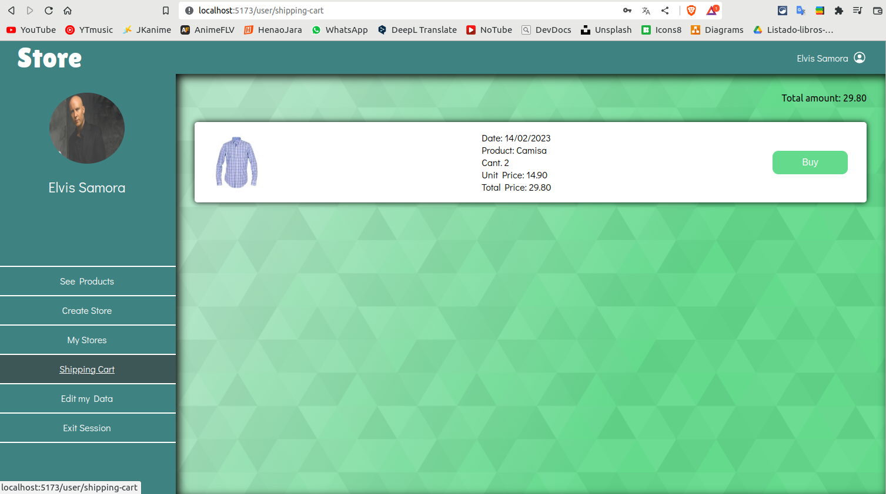
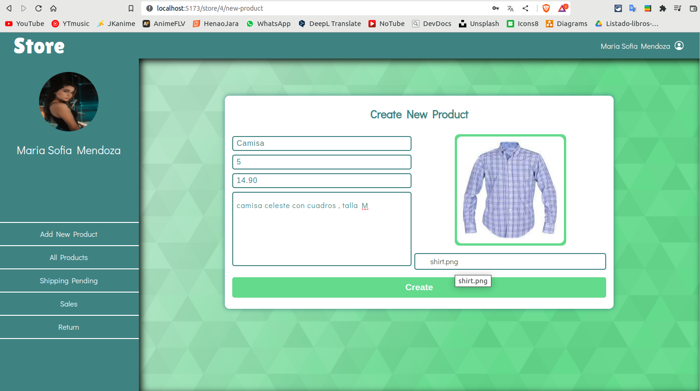

# Tienda Online

> Nota: este es un proyecto personal, el objetivo fue tratar de llevar acabo el desarrollo de una aplicacion web de inicio a fin (la conceptualizacion del proyecto, diseño de wireframes, diseño de la base de datos, desarrollo del back-end y fornt-end).

## Conceptualizacion del Proyecto
* La aplicacion de tienda permitira que un usuario se **registre**, para ello se solicitara su (*nombre, apellido, sexo, nombre de usuario, pais, ciudad, direccion, contraseña*).
* Una vez se registre, se le creara un perfil donde podra visualizar las siguientes opciones **ver productos**,**crear tienda**, en caso de tener una tienda ya creada se mostrara la opcion de **ver mis tiendas**, **Editar datos**, **carrito de compras**, **cerrar sesión**
  * La opcion **ver productos**, llevara al usuario a una pantalla donde se visualizaran todos los productos que se estan vendiendo; se visualizara: *1 foto, nombre del producto, nombre de la tienda, y el precio en dolares, y un boton de más detalles*.
  * La opcion **crear tienda**, permite que el usuario pueda vender sus productos, para ello el usuario debe llenar un formulario ingresando los siguientes datos *nombre de la tienda, tipo de articulos y un boton de crear*
  * La opcion **ver mis tiendas**, aqui el usuario podra ver una lista sus teindas creadas, se visalizara el *(nombre de la teinda, fecha de creacion)* y un boton de ir a tienda.
  * La opcion **carrito de compras**, aqui el usuario podra ver los productos que ha agregado al carrito de compras y podra efectuar el pago; podra visualizar *(nombre producto, precio, cantidad)* y al final de todo un boton de pagar.
* cuando el **usuario cree su tienda** aparecera un menu de opciones: **_agregar nuevo producto, ver lista de productos, ventas pendientes de envio, productos vendidos_**.
  * **agregar nuevo Producto**, si el usuario selecciona esta opcion, se desplegara un formulario con los siguientes campos *nombre del producto, descripcion, precio en dolares*, **es obligatorio que el usuario suba almenos una foto del producto**, tambien apareceran un boton de crear.
  * **ver lista de productos** esta sera la opcion por defecto, mostrara un panel con todos los productos creados con dos opciones **editar o eliminar**
  * **ventas pendientes de envio** en esta opcion el usuario podra ver los pedidos de otros usuarios que ya haigan realizado el pago,  se visualizara los siguientes datos *(nombre del usuario, direccion, pais, nombre del producto, cantidad, imagen del producto)* 
  * **productos vendidos** en aqui se mostrara una lista de los productos que ya fueron enviados y el total del monto de dinero recaudado por las ventas.

## Herramientas
* CSS
* React js
* Node js
* Mysql
* Figma

## Diseño en Figma

## Tareas
### Data Base
* [x] diseño conceptual
  
* [x] diseño logico
  
* [x] diseño fisico
* [x] definir consultas
  
  ---USUARIO---
  * [x] crear usaurio
  * [x] obtener los datos del usuario solo con su user_name
  * [x] mostrar los datos del usuario especifico
  * [x] editar los datos de usuario (nombre, apellido, sexo, username, contraseña, pais, cuidad, direccion, foto)
  
  ---CLIENTE---
  * [x] obtener todos los productos de las tiendas(nombre, imagen, precio, tienda)
  * [x] obtener informacion de un solo producto (foto, nombre, descripcion, tienda, precio, stock)
  * [x] agregar producto al carrito de compras 
  * [x] mostrar productos agregados al carrito de compra de un usuario especifico(foto, producto, cantidad)
  * [x] comprar producto(fecha, status, tienda), generar factura
  
  ---VENDEDOR---
  * [x] crear tienda
  * [x] crear producto (nombre, precio, descripcion, imagen)
  * [x] mostrar los productos creados(nombre, precio, foto)
  * [x] editar productos (nombre, precio, descripcion, imagen)
  * [x] mostrar las tiendas que pertenecen a un usuario especifico(nombre, fecha)
  * [x] mostrar las compras pendientes de envio de una teinda en especifico(foto, cliente, pais, ciudad, direccion, fecha, producto, cantidad)
  * [x] enviar producto al cliente
  * [x] mostrar todos los productos vendidos, es decir, que ya haigan sido enviados(nombre fecha monto total).
  * [x] obtener la suma de todos los precios del ultimo mes
### Backend
* [x] levantar el servidor
* [x] conectar con la base de datos
* [x] crear rutas POST para almacenar datos
* [x] crear rutas GET
* [x] crear rutas UPDATE
* [ ] crear Rutas DELETE (falta)
* [x] crear ruta de registro de usuario
* [x] encriptar contraseña
* [x] crear autenticacion de usuario
### Frontend
* [x] crear header
* [x] crear menu
* [x] crear tienda
* [x] visualizar todas dal tiendas del usuario
* [x] crear producto nuevo
* [x] visualizar todos los productos creados
* [ ] editar producto (falta)
* [ ] borrar producto (falta)
* [x] ver todos los productos que se venden
* [x] ver detalles del producto
* [x] agregar al carrito de compra
* [x] ver carrito de compra
* [x] comprar producto
* [x] enviar producto
* [x] visualizar ventas
* [x] registrar usuario nuevo
* [x] autenticar usuario
* [x] cerrar sesion
* [x] proteger rutas
* [x] editar datos del usaurio   

## Capturas de Pantalla del proyecto
### home

### Registro

### Logueo

### Pagina inicial dentro de la app - Ver Productos

### Crear Tienda

### Editar datos del Usuario

### Carrito de Compra

### Mis tiendas

### Crear un nuevo Producto

### Mi mercancia

### Pedidos Pendientes

### Ventas

## Recursos de Internet

* Foto de [Gabriel Salas](https://unsplash.com/@gabrielsalas?utm_source=unsplash&utm_medium=referral&utm_content=creditCopyText) y  [Midas Hofstra](https://unsplash.com/@midashofstra?utm_source=unsplash&utm_medium=referral&utm_content=creditCopyText) en [Unsplash](https://unsplash.com/es/fotos/YnENabLdEKY?utm_source=unsplash&utm_medium=referral&utm_content=creditCopyText)

* Google Fonts

* Fondo css [svgBackground](https://www.svgbackgrounds.com/)

* Iconos de [ionIcons](https://ionic.io/ionicons)